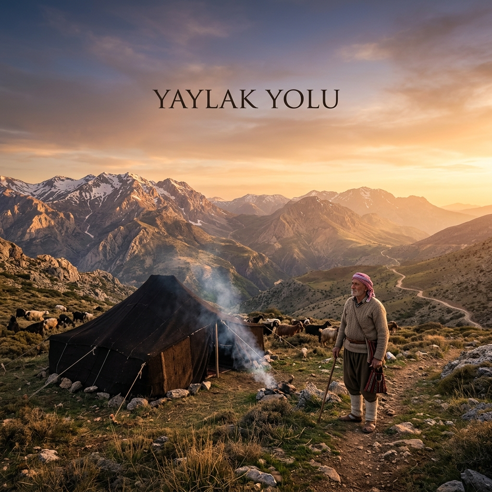

# 🏔️ Yaylak-Yolu: Antalya Yörük Kültürü Dijital Arşivi



## 🏛️ Giriş ve Varoluş Amacı
"Yaylak-Yolu", Akdeniz'in kıyılarından Toroslar'ın karlı zirvelerine uzanan kadim Yörük göç yollarının, yaşam felsefesinin ve kültürel mirasının dijital dünyadaki yankısıdır. Bu depo, Antalya ve çevresindeki Yörük kültürünün kadim izlerini, sözlü geleneğini ve yaşam felsefesini dijital bir platformda toplamak amacıyla oluşturulmuş bir açık kaynak projesidir.

Yörük kültürü, sadece bir göçebe yaşam tarzı değil; doğayla uyumun, dayanışmanın ve bağımsızlığın simgesidir. "Yaylak-Yolu", sahilden Toroslar'ın zirvesine uzanan o zorlu ama bir o kadar da özgür rotanın adıdır.

---

## 🔍 Tematik Odak Alanları

Bu dijital oba, beş ana sütun üzerine inşa edilmiştir. Her bir sütun, Yörük hayatının farklı bir katmanını temsil eder:

### 1. 📜 Sözler ve Felsefe ([sozler/](sozler/))
Yörüklerin hayat tecrübesi, binlerce yıllık bir süzgeçten geçerek bu kısa ve özlü sözlere, manilere ve deyişlere dönüşmüştür.
*   **[Atasözleri ve Deyimler](sozler/wisdom.md):** Doğa, hayvan ve insan üzerine kadim öğretiler.
*   **[Maniler ve Ağıtlar](sozler/maniler.md):** Göç yolundaki duygusal dışavurumlar.

### 2. 📖 Dil ve Lugat ([sozluk/](sozluk/))
Yörük ağzı, Öztürkçe'nin yaşayan bir müzesidir.
*   **[Kadim Kelimeler Tablosu](sozluk/dictionary.md):** "Gıran", "Heybe", "Öveç" gibi yerel kavramlar.
*   **[Etimolojik İzler](sozluk/etimoloji.md):** Kelimelerin binlerce yıllık köken analizi.

### 3. 🧶 Kültür ve Yaşam ([kultur/](kultur/))
Maddi ve manevi kültürün birleştiği noktalar.
*   **[Ontoloji ve Felsefe](kultur/felsefe/ontoloji.md):** Hareketin kutsallığı ve Yörük ruhu.
*   **[Genel Kültür ve Sanat](kultur/culture.md):** Kilim dokuma, yemek kültürü ve gelenekler.
*   **[Hayvancılık Teknikleri](kultur/hayvancilik.md):** Sürü yönetimi, çobanlık ve halk hekimliği.

### 4. 🗺️ Rotalar ve Coğrafya ([rotalar/](rotalar/))
Toroslar'ın haritası Yörüklerin hafızasına kazınmıştır.
*   **[Mevsimlik Göç Hatları](rotalar/migration.md):** Teke Yöresi'nden Akseki'ye ana rotalar.
*   **[Durak ve Konak Yerleri](rotalar/durak-noktalari.md):** Pınarlar, hanlar ve namazgahlar.

---

## 📂 Dosya Yapısı (Genişletilmiş)

```text
Yaylak-Yolu/
├── assets/             # Görsel varlıklar ve bannerlar
├── sozler/             # Atasözleri, deyimler, maniler ve halk edebiyatı
│   ├── wisdom.md       # Atasözleri ve yaşam dersleri
│   └── maniler.md      # Göç ve sevda manileri
├── sozluk/             # Dilbilimsel ve etimolojik arşiv
│   ├── dictionary.md   # Temel kelime listesi
│   └── etimoloji.md    # Köken araştırmaları
├── kultur/             # Sosyolojik ve antropolojik dokümantasyon
│   ├── felsefe/        # Ontolojik ve felsefi altyapı
│   ├── culture.md      # Dokuma, mutfak ve genel gelenekler
│   └── hayvancilik.md  # Çobanlık kültürü ve sürü yönetimi
├── rotalar/            # Coğrafi ve tarihsel iz düşümler
│   ├── migration.md    # Göç yollarının hikayesi
│   └── durak-noktalari.md # Pınar başları ve konaklama yerleri
└── README.md           # Proje ana manifestosu
```

---

## 🤝 Katkıda Bulunma: "Dijital Obaya Odun Taşımak"

Yörük kültürü paylaştıkça yaşar. Bu arşiv, kolektif bir hafızanın ürünüdür. Eğer sizin de bildiğiniz;

1.  **Büyüklerinizden duyduğunuz bir söz,**
2.  **Yörenize özgü unutulmaya yüz tutmuş bir kelime,**
3.  **Kayda geçmemiş bir göç hikayesi veya rota varsa,**

Lütfen bir **Pull Request** açarak veya **Issue** kısmından bildirerek bu dijital obaya katkı sağlayın. Bu meşaleyi birlikte yakalım.

---

## 🏛️ Vizyon ve Miras

> *"Gidip, Toros Dağları'na bakınız, eğer orada bir tek Yörük çadırı görürseniz ve o çadırda bir duman tütüyorsa, şunu çok iyi biliniz ki bu dünyada hiçbir güç ve kuvvet asla bizi yenemez."*
> — **Mustafa Kemal Atatürk**

Bu proje, o dumanın dijital dünyada da tütmeye devam etmesi için başlatılmıştır. Bizim için "Yaylak Yolu", sadece geçmişe bir özlem değil, geleceğe uzanan bir bağımsızlık hattıdır.

---

**Lisans:** Bu proje, kültürel mirasın korunması adına açık kaynak (**MIT**) olarak sunulmaktadır. Paylaşılan bilgiler, aslına sadık kalınarak ve kültürel değerlere saygı çerçevesinde kullanılmalıdır.

---
*Toroslar'ın rüzgarı, klavyelerinizde essin.*